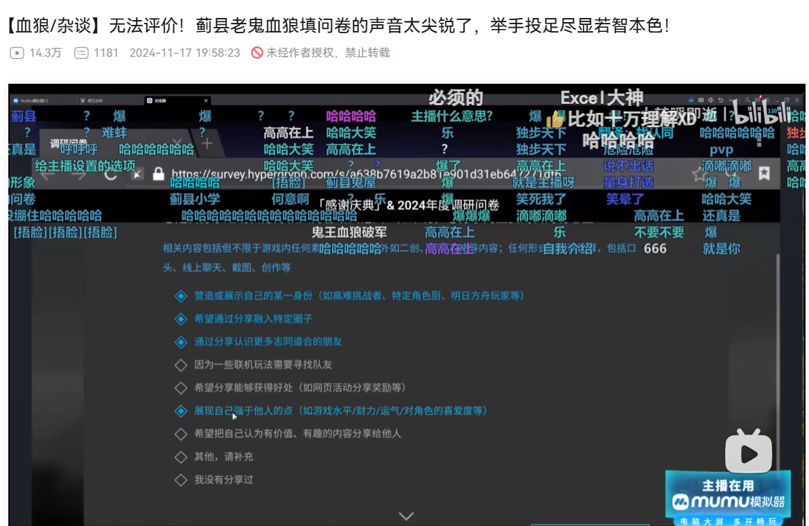

# 重生之我是危机合约设计师

首先声明：危机合约，x都不玩（反正设计师也不玩游戏）

## 如何同时按死小刻和所有物理伤害

愚蠢的做法：敌方防御+10000000%

正确的做法：敌方获得琉璃壁，琉璃壁能够抵挡物理伤害，琉璃壁的防御力+10000000

## 如何设计控制卡

1. 设计XX控制效果，让现有的敌人没有XX抗性

2. 设计危机合约，让有XX控制效果的角色YY登顶

3. 全面普及XX抗性，让角色YY爆金币

4. 回到步骤1

## 如何设计日常Boss

有什么抗性就加什么抗性，10重/失衡免疫，物法减伤99%，物法闪避99%，最好是超高dph的5连击远程打10物法混伤（dps当然也不能落下，攻速也要快）+九宫格溅射

核心思想：控制是fw，推拉查无此人，物法人下人，重装纸对折

> 危机合约一年开放14天呢，你怎么能说你的控制卡是fw呢，这不是给你高光的机会了？

## 如何设计活动机制

玩家只要利用活动机制就能降低关卡难度；但玩家大概率是没法在关键时刻用上活动机制的。

> 狼在就有输出，但狼大概率是不在的。—— b三狼圣经

核心思想：活动机制是为了保证策划站在难度讨论至高点上的，而不是真的给玩家降低难度的。

> 陷阱烟花（突袭）：
https://prts.wiki/w/PV-EX-1_%E9%9B%B6%E9%A3%9F%E6%B4%BE%E9%80%81
> 
> 比命长的引线：
https://prts.wiki/w/PV-S-3_%E4%BB%93%E7%9A%87%E6%AD%A5%E6%B3%95

## 如何修程序bug

本游戏没有程序bug，只有文本错误

## 如何管理社区、遏制强度讨论

角色菜、没有发挥空间，都是x狼x军、蓟县小鬼带节奏导致的，从来都不是设计师的匠心设计的关卡、给敌人填的抗性、给角色填的数值导致的

> 设计师匠心设计的2w甲就算有99%的责任，蓟县小鬼难道就没有1%的责任吗？

---

对了，还有变相收买测评up

不知道x狼x军已经收了丫丁多少米了，他的话还能代表他的真实想法吗？

> 小子，声音这么尖锐，还想要终末地测试资格吗？

中杯偏上的琳琅诗怀雅：

泛用性较低，对策性较低 ——> 中杯偏上

大杯偏下（模组未出时）的薇薇安娜：

泛用性较低，对策性一般 ——> 大杯偏下

新时代大杯忍冬：

泛用性低，对策性较低 ——> 大杯

综上，我们有结论：

较低+较低 < 低+较低

较低+一般 < 低+较低

太自洽了

> 杯论三等分，将会导致相当荒唐的结论。合理怀疑x狼x军的相对杯论的诞生就是为了当和事佬、烂好人，毫无锐气。如果超大杯、大杯和中杯的比例是1：1：1，那么丫丁完全可以出200个四爷，从而让所有现存角色都变为超大杯。
>
> 至多13个出击位的游戏，你告诉我杯级的划分是依照相对地位？差不多得了。角色的数量的确膨胀了，我怎么没见到出击位的数量随之膨胀呢？菜菜干员不会因为多出了200个四爷就能有什么地位的提高。
>
> 13个出击位的游戏，不看绝对排名而是看相对地位给杯级，闹麻了。

---

> 强度排榜本质上是在对向量降维。将影响强度的若干变量（费用、初动、回转、总伤、伤害类型、dps、dph（物理伤害）、出伤模式、伤害构成等等）构成的角色强度向量降维成一维的角色强度数值，从而让所有角色能够在这个一维维度上构建出一个全序关系。从数学的角度来看，这显然是荒唐至极的。降维将引入巨大的信息损失，难以完整刻画原始角色的全貌。更不要说降维函数的选择，本身也带有极大的主观性成分。所有分量求和也是降维，求积也是降维，凭什么你的降维优越，我的降维就不优越呢？就因为你在b站打过了几次危机合约的最高难度吗？那我看还是直接给攻略者排榜得了，确定谁的降维函数优越，谁才是蓟县的帝王。
且不论一般二游的角色设计，是很难出一个老角色的绝对上位的（即强度向量的一些分量都向着更好的方向膨胀，如总伤更高、费用更低等，其他的分量都至少保持不变），因此试图在所有角色内建立一个数学上的全序也同样是无法做到的。设计师往往为了避免强度膨胀过于露骨，会在数值膨胀的过程中，有意地增加一些仅有象征意义的角色差异化设计（简称杂技）。
>
> 为什么没多少人做排榜？因为它不对，仅此而已。你不可能做出正确的榜单，正如你无法通过正确的推导得到2+2=5。但很显然，排榜的人比起追求正确，似乎更乐于追求争斗。
>
> 水浒传看多了导致的。一百单八将是政治的游戏，不是数学的游戏。

## 如何设计合约强卡

干员原有的面板数值清零，天赋：攻击力+xxx，防御力+yyy，攻击间隔变为zzz，部署时攻速重置为100，以此类推。

> 主播主播，你设计的危机合约特化角色确实很强，但是太吃操作了，真的有人会为这种角色买单吗？
>
> 有的兄弟，有的。你要相信虚荣的力量。
>
> 丫丁可太懂玩家的画像了：

https://www.bilibili.com/video/BV1MiUkYFEC2/

